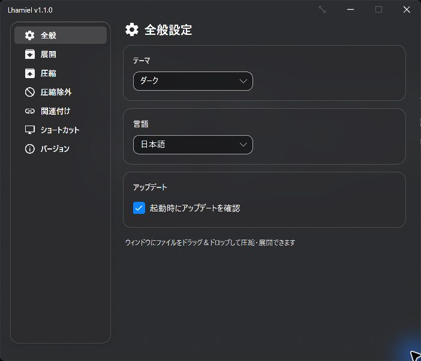
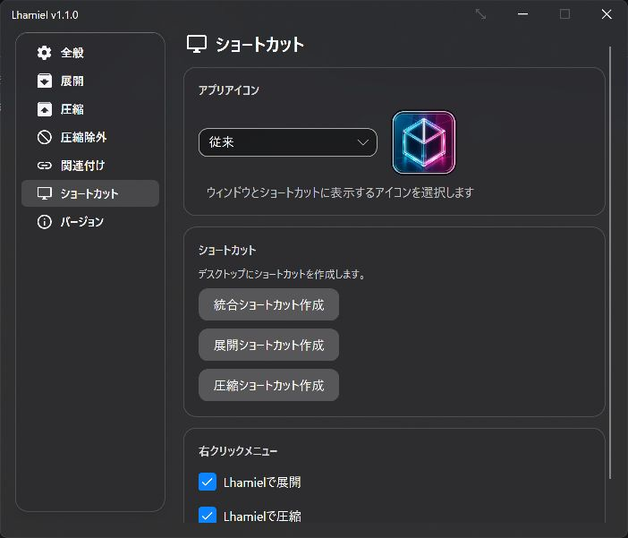

# Lhamiel

**ドラッグ＆ドロップと右クリックで使える、Windows向けアーカイブ圧縮・展開アプリ**

Lhamiel（ラミエル）は、ファイルやフォルダーを ZIP / 7z / TAR / LZH に圧縮し、ZIP・7z・RAR・LZH などのアーカイブを展開するアプリです。パスワード保護、圧縮対象の除外ルール、同名ファイルの競合解決に対応し、Windows x64 / ARM64 で利用できます。

全般設定（v1.1.0・ダークテーマ）



ショートカット設定（v1.1.0・ダークテーマ）



## 主な特徴

- **かんたん操作** — ファイルをウィンドウにドラッグ＆ドロップするだけで、自動的に圧縮または展開を開始
- **二重ネスト防止** — 「アーカイブ名でフォルダを作成する」ON時、アーカイブ内ルートフォルダがアーカイブ名と一致する場合はフォルダ作成をスキップして二重ネストを防止
- **使用中ファイルへの対応** — 他のアプリが使用中でも読み取れるファイルは圧縮し、アクセスできないファイルはログに記録してスキップ。パスワード付き圧縮ではスキップ件数を画面でも通知
- **隠し/システム属性も圧縮対象に含められる** — `.git` など Hidden/System 属性のフォルダが意図せず欠落しないよう、圧縮設定から対象有無を切り替え可能
- **共通・フォルダー別の圧縮除外** — すべての圧縮に適用する共通ルールを設定画面で管理し、圧縮元の `.lhamielignore` や `.gitignore` も優先順付きでフォルダー別ルールとして利用可能
- **パスワード保護アーカイブ対応** — 暗号化された ZIP / 7z / RAR をドロップすると入力ダイアログが開き、誤入力時は自動的に再試行
- **パスワード付き圧縮** — ZIP / 7z を AES-256 で暗号化して作成可能。パスワードは「毎回入力」と「記憶する」（Windows アカウントに紐づく DPAPI 暗号化で保存）の 2 モード、7z はファイル名の暗号化（ヘッダ暗号化）にも対応
- **ファイル衝突解決** — 展開・圧縮時に同名ファイルが競合した場合、Windows風のファイル比較ダイアログで選択的に処理。サムネイル表示や同一ファイル（日付・サイズが一致）の一括スキップに対応
- **ディスク容量チェック** — 開始前の容量不足は、空きを確保して再確認できます。処理中も定期監視し、容量不足を検出した場合は処理を中止するため、空きを確保してから実行し直してください
- **エラー回復** — 破損アーカイブでも可能な限りファイルを救出。「スキップ」や「再試行」を選択可能
- **ファイル関連付け** — よく使う形式を関連付ければ、ダブルクリックで素早く展開
- **右クリックメニュー** — 「Lhamielで展開」と「Lhamielで圧縮」を個別にON/OFF可能。Windows 11の新メニューと、Kirihaなどの従来型メニューを使うファイルマネージャーに対応。展開直通ルートは自己展開形式の EXE にも対応し、Windows 10 / 11 の両方で利用可能
- **用途別デスクトップショートカット** — 従来どおり自動判定する統合ショートカットに加え、展開直通・圧縮直通ショートカットを作成可能。どのショートカットもダブルクリックでは通常画面を起動
- **テーマ切替** — ダーク / ライト / システム追従の3モード対応（アクリルブラー背景）
- **統一したダイアログと進捗表示** — 確認・パスワード・問い合わせなどの画面は本文とボタン領域を同じ背景色に統一。圧縮中は対象確認・準備・仕上げの状態も表示
- **17言語対応** — 日本語・英語をはじめ17言語のUIローカライズに対応
- **ネイティブ AOT ビルド** — .NET ランタイム不要で起動が速く、Windows x64 / ARM64 の両方に対応
- **自動更新** — メイン画面起動時に新しいバージョンを確認し、更新ダイアログで案内。Windowsログイン時にはバックグラウンドでも更新を確認・適用（詳しくは[更新について](#更新について)）

## インストール方法

1. 最新の `Setup.exe` をダウンロード（Cloudflare R2 配信、固定 URL のため常に最新版が落ちてきます）
   - **x64**: <https://lhamiel.kagayoi.com/Lhamiel-win-Setup.exe>
   - **ARM64**: <https://lhamiel.kagayoi.com/Lhamiel-win-arm64-Setup.exe>
2. `Setup.exe` を実行してインストール
3. デスクトップやスタートメニューから Lhamiel を起動

## アンインストール方法

Windows の「設定」→「アプリ」→「インストールされているアプリ」から「Lhamiel」を選択し、「アンインストール」を実行してください。スタートアップ登録、Lhamiel の右クリックメニュー、Lhamielが設定したファイル関連付けはアンインストール時に自動で解除されます。

## システム要件

| 項目 | 内容 |
|------|------|
| **OS** | Windows 10 / 11 (x64, ARM64) |
| **ランタイム** | 不要（ネイティブ AOT ビルド、.NET 10） |
| **権限** | 一般ユーザー権限で動作 |

## 使い方

### 圧縮する

1. Lhamiel を起動
2. 圧縮したいファイルやフォルダをウィンドウにドラッグ＆ドロップ
3. 自動的に圧縮が開始

> 「圧縮」設定の「圧縮形式」から ZIP / 7z / TAR / LZH を切り替えられます。
> 「圧縮」設定で、複数ファイルを1つのアーカイブにまとめるか、ディレクトリ構造（ルート含める / ルート含めない / フラット）をどうするかを指定できます。
> パスワード保護は ZIP / 7z で利用できます。TAR / LZH はパスワード保護に対応していません。

### 展開する

1. アーカイブファイルを Lhamiel のウィンドウにドラッグ＆ドロップ
2. 設定に従い自動展開（「アーカイブ名でフォルダを作成する」ON時はアーカイブ名フォルダに展開）
3. パスワード保護アーカイブの場合は入力ダイアログが開くのでパスワードを入力

複数のアーカイブをまとめてドロップすると、それぞれを展開します。通常のドロップ操作は、すべてが対応アーカイブなら展開、それ以外なら圧縮として扱います。アーカイブと通常ファイルを混ぜてドロップした場合は圧縮になります。

「展開後に保存先のフォルダを開く」「圧縮後に保存先のフォルダを開く」をONにすると、完了後にWindowsで設定した既定のファイルマネージャーで保存先を開きます。

### 右クリック・ショートカットから操作する

「ショートカット」タブで右クリックメニューを有効化したり、用途別のデスクトップショートカットを作成したりできます。

| 操作 | 動作 |
|------|------|
| 右クリックの「Lhamielで展開」 | 選択したファイルを展開。対応する自己展開形式の EXE も対象 |
| 右クリックの「Lhamielで圧縮」 | 選択したファイル・フォルダーを圧縮 |
| 「Lhamiel」ショートカットへドロップ | ファイルの種類から圧縮・展開を自動判定 |
| 「Lhamiel展開」「Lhamiel圧縮」へドロップ | 指定した処理を実行 |

右クリックからの圧縮は、別の圧縮処理が実行中でも新しい処理を並行して開始します。同じ出力ファイルへ保存する場合は、先の処理が終わってから続けます。

ショートカットをダブルクリックした場合は、どれも通常の設定画面を開きます。Windows 11では新しい右クリックメニューと「その他のオプション」、Windows 10やKirihaなどでは従来のメニューから利用できます。

### 設定

設定画面はサイドバーレイアウトで構成されており、変更は即時適用されます。

| タブ | 内容 |
|------|------|
| **全般** | テーマ切替、言語選択、起動時にアップデートを確認 ON/OFF |
| **展開** | 展開先ディレクトリ指定（同一階層 / 固定ディレクトリ）、展開後にフォルダを開く、アーカイブ名フォルダ作成ON/OFF |
| **圧縮** | デフォルト圧縮形式、圧縮先ディレクトリ指定、圧縮後にフォルダを開く、まとめ圧縮、ディレクトリ構造モード、ZIP / 7z の圧縮レベル、LZH の圧縮方式（[対応形式](#圧縮)参照）、パスワード保護（AES-256、毎回入力 / 記憶、7z はファイル名暗号化対応）、Hidden/System 属性の対象化 |
| **圧縮除外** | 全圧縮共通の除外ルールと、`.lhamielignore` / `.gitignore` など圧縮元フォルダー別ルールの読み込み方針を管理 |
| **関連付け** | ダブルクリックで Lhamiel を開く拡張子の選択（一括選択 / 一括解除に対応）、ファイルアイコンをクラシック / フォルダ / ゆるふわリボン / 氷のフォルダから選択 |
| **ショートカット** | アプリアイコン（従来／パステルクリスタル／レガシー）、統合／展開／圧縮ショートカット作成、右クリックメニュー「Lhamielで展開」／「Lhamielで圧縮」の個別 ON/OFF |
| **バージョン** | バージョン情報・7-Zip ライブラリバージョン表示、アップデート確認、スキップしたバージョンの取り消し、メール認証付き問い合わせフォーム、診断 ZIP の出力、ライセンス表示 |

### 圧縮除外ルール

「圧縮除外」タブでは、すべての圧縮に適用する共通ルールと、圧縮元フォルダーごとのルールを設定できます。どちらも `.gitignore` 互換の構文（`*`、`?`、`**`、`!` による再包含、末尾 `/` のディレクトリ指定など）を使用します。

#### すべての圧縮に適用する共通ルール

設定画面の「共通の除外ルール」で編集した内容は、次のファイルに保存されます。

```text
%LocalAppData%\Lhamiel\.lhaignore
```

このファイルはLhamiel全体のグローバル設定であり、圧縮元に関係なくすべての圧縮へ適用されます。たとえば、常に除外したいログや一時ファイルを指定できます。

```gitignore
*.tmp
**/cache/
Thumbs.db
```

#### 圧縮元フォルダーごとのルール

「圧縮元フォルダー内の除外ルールを使用する」をONにすると、圧縮元の各フォルダーに置かれた除外ルールファイルも読み込みます。「認識するファイル名」には1行に1ファイル名を指定し、上にある名前ほど高優先です。

```text
.lhamielignore
.gitignore
```

この候補一覧と読み込みのON/OFFは、すべての圧縮に共通するグローバル設定です。一方、各ルールファイルに書かれた除外内容は、そのファイルを置いたフォルダーと配下だけに適用されます。

フォルダー別ルールの読み込みは既定でOFF、認識するファイル名の既定値は `.gitignore` のみです。上の例では、読み込みをONにしたうえで、Lhamiel専用の `.lhamielignore` を `.gitignore` より優先します。Gitと異なる内容で圧縮したい場所には `.lhamielignore` を置き、Gitと同じ除外内容を使う場所では `.gitignore` を利用できます。

候補順位は、圧縮元のディレクトリツリーを下るときに分岐ごとに継承されます。

- 同じフォルダーに複数の候補がある場合は、一覧で最も上にある1ファイルだけを使用します。
- 子フォルダーでは、祖先と同じ候補、または祖先より高優先の候補へ切り替えられます。
- 一度高優先の候補へ切り替わった分岐では、それより低優先の候補へ戻りません。
- 兄弟フォルダーは別の分岐として、それぞれ独立した候補順位を継承します。
- 候補ファイルが空でも「その候補を選択した」扱いになり、子孫で低優先候補へ戻りません。

候補が `.lhamielignore` → `.gitignore` の順の場合、親子の組み合わせは次のようになります。

| 祖先で有効な候補 | 子フォルダーにある候補 | 子フォルダーでの動作 |
|---|---|---|
| なし | `.gitignore` | `.gitignore`を採用 |
| なし | `.lhamielignore` | `.lhamielignore`を採用 |
| `.gitignore` | `.gitignore` | 同じ候補としてルールを追加 |
| `.gitignore` | `.lhamielignore` | 高優先の `.lhamielignore`へ切り替え |
| `.lhamielignore` | `.lhamielignore` | 同じ候補としてルールを追加 |
| `.lhamielignore` | `.gitignore` | 低優先へ戻るため、ルールとしては読み込まない |

たとえば、次の構成ではルートの `.gitignore` から `custom` 分岐だけが `.lhamielignore`へ切り替わります。

```text
Project\
├─ .gitignore                 ← Project全体で最初に採用
├─ custom\
│  ├─ .lhamielignore          ← 高優先へ切り替え
│  └─ child\
│     └─ .gitignore           ← 低優先へ戻るため読まない
└─ legacy\
   └─ .gitignore              ← 別分岐なので引き続き読む
```

ルールは親から子へ階層的に追加されます。ルートのルールはツリー全体へ適用され、子フォルダーのルールはそのフォルダー以下だけに適用されます。同じファイルに複数のルールが一致した場合は、より深いフォルダーのルールが後から評価されるため、`!keep.log` などで親の除外を上書きできます。

```text
Project\.gitignore        : *.log
Project\custom\.lhamielignore : !keep.log
```

この場合、`Project\custom\keep.log` は圧縮対象へ戻りますが、`Project\legacy\keep.log` には `custom` のルールは影響しません。

> **注意:** 親のルールでディレクトリ自体が除外された場合、その中は走査されません。したがって、除外されたディレクトリ内の `.lhamielignore` や `.gitignore` でファイルを再包含することはできません。

> **ルールファイル自身について:** 読み込まれた `.lhamielignore` や `.gitignore` は、自動的にはアーカイブから除外されません。アーカイブへ含めたくない場合は、共通ルールまたはフォルダー別ルールへ `.lhamielignore` / `.gitignore` を明示してください。低優先のため「ルールとして読まない」ファイルについても同様です。

## 対応形式

### 圧縮

- ZIP
- 7z（高圧縮）
- TAR
- LZH（無圧縮のLH0 / LH5 / LH6 / LH7を設定で選択。既定はLH5、圧縮で大きくなる項目は無圧縮で格納）

LZHの圧縮・展開には同梱のUnLhaReを使用します。LZH作成は1ファイル256MiBまでで、パスワード暗号化には対応しません。読み取れない入力だけをスキップして残りを圧縮し、全件を読めない場合は空書庫を作らず失敗します。キャンセルは一覧取得、入力読み込み、各ファイルの圧縮計算前後に受け付けます。単一ファイルの圧縮計算中は完了まで待つ場合があります。

### 展開

- ZIP, 7z, TAR
- RAR, LZH / LHA, CAB, ARJ
- GZIP (.gz, .tgz), BZIP2 (.bz2, .tbz2, .tbz), XZ (.xz, .txz), LZMA (.lzma, .tlz)
- Z (.z, .tz)

## 対応言語

| 言語 | コード | ネイティブ名 |
|------|--------|-------------|
| 英語 | `en_US` | English |
| 日本語 | `ja_JP` | 日本語 |
| 中国語（簡体字） | `zh_CN` | 简体中文 |
| 中国語（繁体字） | `zh_TW` | 繁體中文 |
| ドイツ語 | `de_DE` | Deutsch |
| フランス語 | `fr_FR` | Français |
| スペイン語 | `es_ES` | Español |
| イタリア語 | `it_IT` | Italiano |
| ポルトガル語（ブラジル） | `pt_BR` | Português (Brasil) |
| ロシア語 | `ru_RU` | Русский |
| ウクライナ語 | `uk_UA` | Українська |
| インドネシア語 | `id_ID` | Bahasa Indonesia |
| タガログ語 | `fil_PH` | Tagalog |
| タミル語 | `ta_IN` | தமிழ் |
| 韓国語 | `ko_KR` | 한국어 |
| ラテン語 | `la_VA` | Latina |
| サンスクリット語 | `sa_IN` | संस्कृतम् |

> 言語はシステムのロケールから自動検出されます。「全般」設定から手動で変更することも可能です。

## 更新について

- **メイン画面起動時** — 「全般」の「起動時にアップデートを確認」がONのとき、新しいバージョンがあれば更新ダイアログを表示します。「ダウンロード＆インストール」または「このバージョンをスキップ」を選べます。
- **手動確認** — 「バージョン」の「アップデート確認」から確認できます。手動確認ではスキップしたバージョンも対象になります。
- **Windowsログイン時** — インストール時に登録されるスタートアップ処理が、画面を開かずに更新を確認・適用します。Lhamielが起動中の場合は見送ります。この処理には、アプリ内の起動時確認設定やバージョンのスキップ設定は適用されません。

起動時の更新ダイアログを止めるには、アプリの「起動時にアップデートを確認」をOFFにします。Windowsログイン時のバックグラウンド更新も止める場合は、Windowsのスタートアップ設定でLhamielを無効にしてください。

## トラブルシューティング

- **展開できない場合** — アーカイブが破損している可能性があります。ダイアログで「スキップ」を試すと一部ファイルを取り出せる場合があります
- **「パスワードが必要、または不一致です」と表示される** — パスワード保護アーカイブです。入力ダイアログに正しいパスワードを入力してください。キャンセルすると展開は中止されます
- **Lhamiel で作ったパスワード付き ZIP が Windows エクスプローラーで開けない** — Lhamiel のパスワード付き ZIP は強力な AES-256（WinZip AE-2 形式）で暗号化されるため、エクスプローラー標準機能では展開できません。Lhamiel・7-Zip・WinRAR など AES-256 対応ソフトで展開してください
- **関連付けが効かない** — 他のソフトが優先されている場合があります。「関連付け」タブで再設定するか、Windows の「既定のアプリ」を確認してください
- **圧縮したアーカイブに一部のファイルがない** — 共通・フォルダー別の除外ルールとHidden/System属性の設定を確認してください。ほかのアプリによるロックなどで読み取れなかったファイルはスキップされます。ログを確認し、使用中のアプリを閉じてから再実行してください
- **「仕上げ処理中...」のまま時間がかかる** — アーカイブの書き込み完了処理を行っています。ファイル数が多いと時間がかかるため、完了するまでお待ちください
- **ログファイルの場所** — `%LocalAppData%\Lhamiel\Lhamiel_yyyyMMdd.log`。並行して開始した圧縮のログは同じ場所の `Lhamiel_compression_<PID>_yyyyMMdd.log`（ローリング保存、既定で 7 日間保持）
- **クラッシュダンプの場所** — `%LocalAppData%\Lhamiel\dumps\*.dmp`（アプリが終了する未処理例外時に自動生成、最新 5 件まで保持）。動作を継続できるバックグラウンドタスクの例外はログに記録し、ダンプは生成しません。ダンプはメモリ上のパスワードなどを含む可能性があるため、診断 ZIP には含まれません
- **診断情報の取得方法** — サポート問い合わせの際は「バージョン」設定タブの「診断 ZIP を出力」ボタンを使用してください。マスク済み設定・ログ・環境情報がまとめて ZIP 化されます
- **一時ファイルの自動削除** — アプリ起動時に `%TEMP%\Lhamiel_Temp_*` の 30 分以上前の残骸を自動で掃除します（前回クラッシュ時の中間ファイル等）
- **自動更新が失敗する場合** — Velopack 自動更新が動かない場合は、Cloudflare R2 配信元から最新の Setup.exe を手動ダウンロードして上書きインストールしてください（x64: <https://lhamiel.kagayoi.com/Lhamiel-win-Setup.exe> / ARM64: <https://lhamiel.kagayoi.com/Lhamiel-win-arm64-Setup.exe>）
- **アップデートダイアログが起動毎に出る** — 「このバージョンをスキップ」で、そのバージョンの起動時通知を止められます。更新確認を止める設定とWindowsログイン時の処理については[更新について](#更新について)を参照してください
- **スキップしたバージョンを取り消したい** — 「バージョン」設定タブにスキップ中のバージョン情報と「スキップを取り消す」ボタンが表示されます。ボタンを押すと即座に取り消され、次回起動時から再びアップデート通知が出ます
- **手動でアップデートを確認したい** — 「バージョン」設定タブの「アップデート確認」ボタンを押してください。スキップしたバージョンも含めて更新の有無を確認できます

## 更新履歴

バージョンごとの変更点は [CHANGELOG.md](CHANGELOG.md) を参照してください。

## 連絡先

- **メール:** 1llum1n4t1@duck.com
- **利用上のお問い合わせ・不具合:** アプリの「設定」→「バージョン」→「お問い合わせフォームを開く」から送信できます。メール認証後に受付状況を確認でき、ほかの利用者の問い合わせは表示されません
- **開発者向けの技術課題・コントリビューション:** https://github.com/1llum1n4t1s/Lhamiel/issues

## ライセンス

Lhamiel は MIT License の下で公開されています。

Copyright (c) 2025-2026 ゆろち

詳細は [LICENSE](LICENSE) ファイルをご参照ください。
